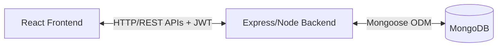
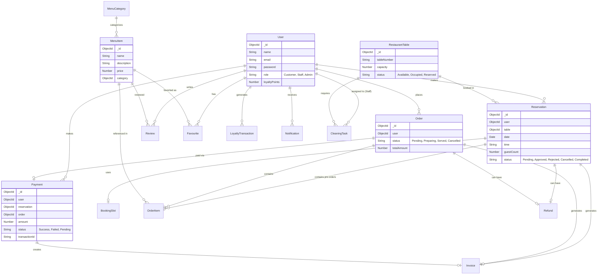

# DineEase Project Architecture

## 1. System Architecture

DineEase is built on a standard MERN (MongoDB, Express, React, Node.js) stack architecture.

- **Frontend (Client)**: A Single Page Application (SPA) built with React and Vite. It handles the UI, client-side routing, and state management.
- **Backend (Server)**: An Express.js application running on Node.js that serves as a RESTful API. It handles business logic, authentication (JWT), and database interactions.
- **Database**: MongoDB (NoSQL) stores all application data, utilizing Mongoose as an Object Data Modeling (ODM) library.

### High-Level Flow


## 2. Directory Structure

The project uses a monorepo setup via npm workspaces:

```text
DineEase/
├── client/                 # React Frontend
│   ├── public/             # Static assets
│   ├── src/                # Frontend source code
│   │   ├── components/     # Reusable UI components
│   │   ├── pages/          # Full page views
│   │   ├── hooks/          # Custom React hooks
│   │   ├── context/        # React Context providers (e.g., Auth)
│   │   └── services/       # API integration functions
│   └── package.json
├── server/                 # Express Backend
│   ├── src/
│   │   ├── controllers/    # Request handlers containing business logic
│   │   ├── models/         # Mongoose schemas (Domain Entities)
│   │   ├── routes/         # Express route definitions
│   │   ├── middlewares/    # Custom middleware (Auth, Error handling)
│   │   ├── config/         # DB connection & environment config
│   │   └── utils/          # Helper functions
│   └── package.json
├── docs/                   # Project documentation
└── package.json            # Root workspace configuration
```

## 3. Database Entity Relationship Diagram (ERD)

The following Mermaid diagram illustrates the major Mongoose models and their relationships within the DineEase system.



## 4. Key Design Patterns

- **MVC (Model-View-Controller) adaptation**: The backend strictly separates routing (`routes/`), request handling and business logic (`controllers/`), and database interaction (`models/`).
- **RESTful API**: Standardized API endpoints mapping to HTTP methods (GET, POST, PUT, DELETE).
- **JWT Authorization Bearer flow**: The frontend stores the token and attaches it to the `Authorization: Bearer <token>` header for protected routes.
- **Role-Based Guards**: Backend middleware and frontend Higher-Order Components (HOCs) restrict access based on the user's role (Customer, Staff, Admin).
