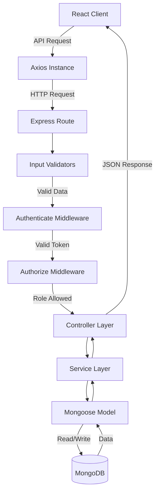

# System Architecture Pipeline

The following diagram illustrates the complete request lifecycle and architectural pipeline of the DineEase application, from the frontend client to the backend database.

